# Monitoramento de Servidor Web com AWS e Discord

Este projeto configura um servidor web na AWS, implementa um sistema de monitoramento e envia alertas via Discord.

## 📌 Etapas do Projeto
1. **Configuração do Ambiente**
2. **Instalação e Configuração do Servidor Web**
3. **Implementação do Script de Monitoramento**
4. **Testes e Validação da Solução**

### 🔹 Tecnologias Utilizadas
- Conta AWS ativa
- Gitbash
- Discord
- Nginx

## 🛠️ Configuração do Ambiente

### 1. Criação de uma VPC
1. Acesse o AWS Management Console.
2. Vá para VPC > Your VPCs.
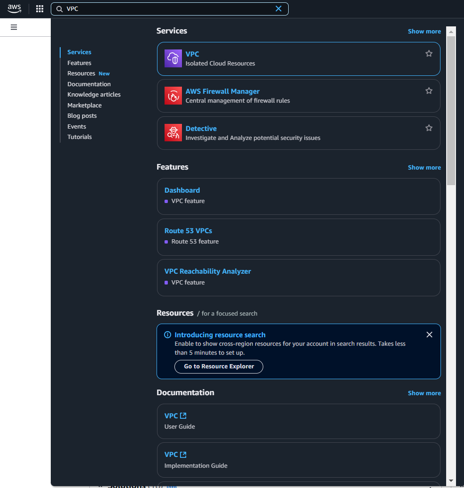   
3. Clique em Create VPC.
4. Escolha do nome para a VPC.
5. Definição de um bloco CIDR: 10.0.0.0/16.
6. Configuração da criação de 2 sub-redes públicas e 2 privadas.
   
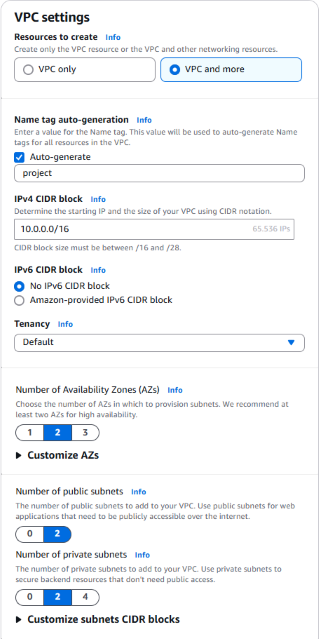

8. Clique em Create VPC.  
<br>  
  
### 3. Criação de um Security Group:
1. No console EC2 acesse "Security" Groups e crie um novo com as seguintes regras:
1. HTTP (porta 80, TCP, 0.0.0.0/0) → Permite tráfego web.
2. SSH (porta 22, TCP, My IP) → Para acessar via SSH.
4. Clique em Create Security Group.

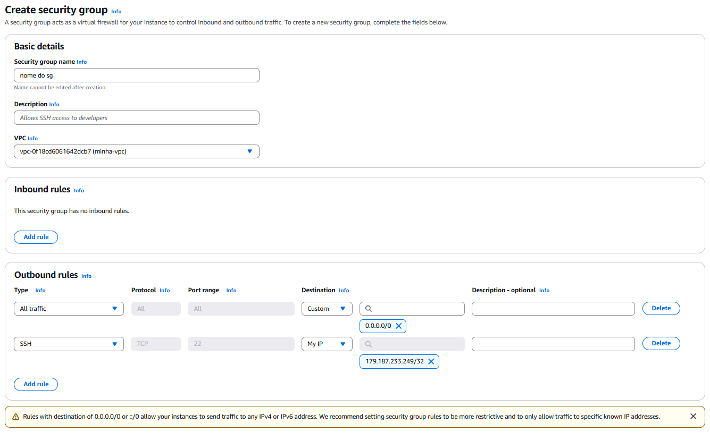

### 4. Criação de uma Instância
1. Acesse o AWS Management Console.
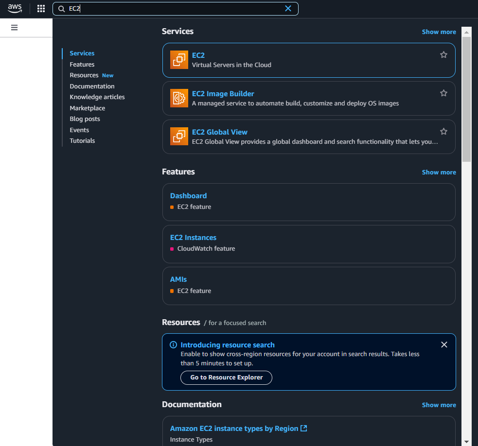   
2. Vá para EC2 > Instances > Launch Instance.
3. Escolha o nome e as tags necessárias para a criação para a da instância.
4. Escolha da AMI baseada em Linux Ubuntu LTS (versão utilizada foi a 24.04).

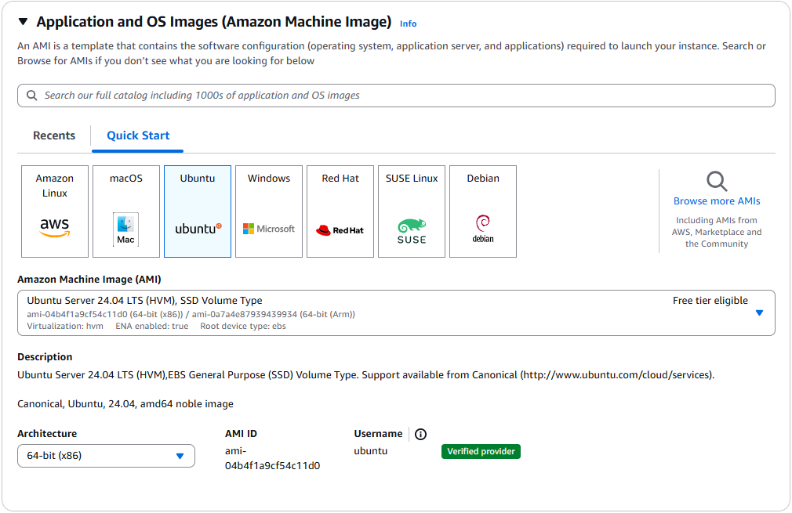   <br>  <br>  
#### 🔹Key pair
1. Na sua maquina, crie uma pasta .ssh da seguinte forma 
````
C:\Users\SEU-USUARIO\.ssh
````
5. Criação da chave SSH em "Create new key pair"
6. Escolha do nome e a opção .pem.

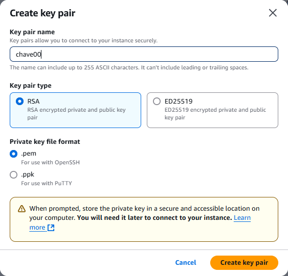
#### 🔹Network Settings
1. Em Network Settings: Selecione a VPC que você criou.
2. Escolha uma das sub-redes públicas.
3. Habilite a opção Auto-assign Public IP (para acesso externo via SSH).
4. Associe o Security Group criado

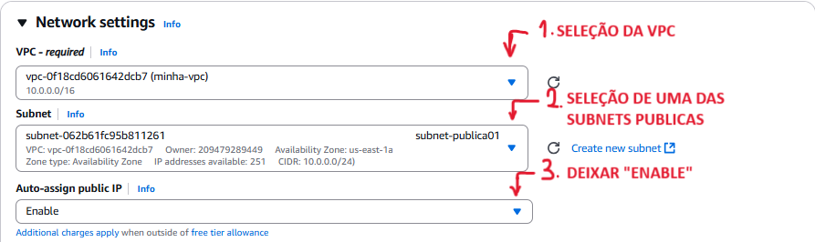

### 5. Acessar a Instância via SSH
1. No seu terminal terminal Git Bash use o seguinte comando para ajustar as permissões da sua chave:
````
chmod 400 ~/.ssh/sua-chave.pem
````

2. Para conectar use:
````
ssh -i ~/.ssh/sua-chave.pem ubuntu@IP_DA_INSTÂNCIA
````
> **Nota:**  
Para ter o ip da sua instância acesse o ec2 console e clique na sua instância
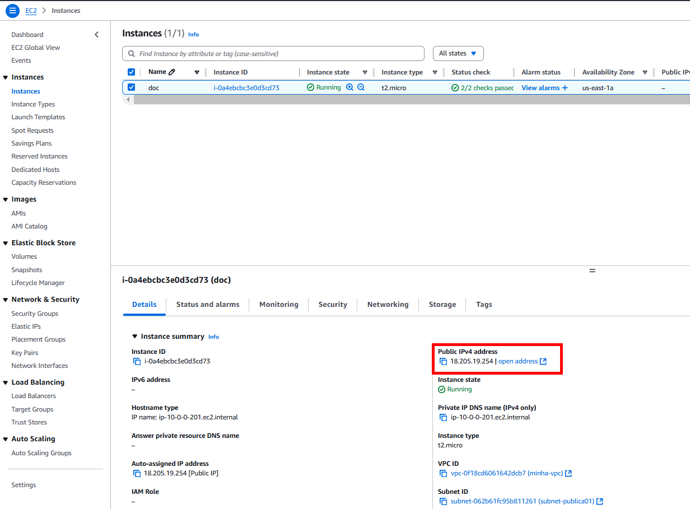

3. Ao conectar o terminal devera ficar da seguinte maneira:
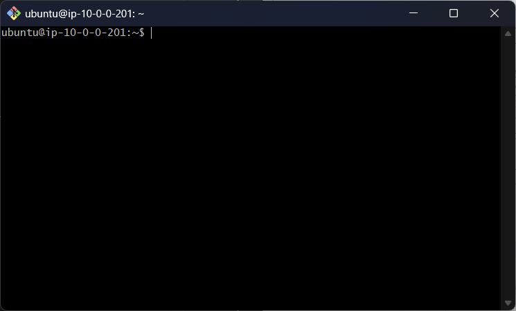<br><br>


## 🌐 2. Instalação e Configuração do Servidor Web

### 🔹 Atualizar pacotes e instalar Nginx
```bash
sudo apt update && sudo apt upgrade -y
sudo apt install nginx -y
```

### 🔹 Verificar se o Nginx está rodando
```bash
systemctl status nginx
```
 **Exemplo de saida quando o Nginx está ativo e funcionando:**
``` 
nginx.service - The nginx HTTP and reverse proxy server
     Loaded: loaded (/lib/systemd/system/nginx.service; enabled; vendor preset: enabled)
     Active: active (running) since Fri 2025-02-14 11:47:40 UTC; 5min ago
   Main PID: 26380 (nginx)
      Tasks: 2 (limit: 1111)
     Memory: 2.4M
        CPU: 41ms
     CGroup: /system.slice/nginx.service
             ├─26380 "nginx: master process /usr/sbin/nginx"
             └─26384 "nginx: worker process"

Feb 14 11:47:40 ip-10-0-0-93.ec2.internal systemd[1]: Started nginx.service - The nginx HTTP and reverse proxy server.
```

### 🔹 Criar uma página HTML simples
```bash
sudo nano /var/www/html/index.html
```
Exemplo de conteúdo:
```html
<!DOCTYPE html>
<html>
<head>
    <title>Servidor Ativo</title>
</head>
<body>
    <h1>Meu servidor esta funcionando!</h1>
</body>
</html>
```

> **Nota:** <br>
No diretório há uma landing page criada especialmente para o projeto. No entanto, para facilitar a didática, o exemplo de código será algo mais enxuto. [(acesso ao site feito para o projeto)]([https://github.com/IgorLGomes/Servidor-Web-com-Monitoramento](https://igorlgomes.github.io/Servidor-Web-com-Monitoramento/))


### 🔹 Reiniciar o Nginx para aplicar as mudanças
```bash
sudo systemctl restart nginx
```

### 🔹 Acesse seu link ipv4
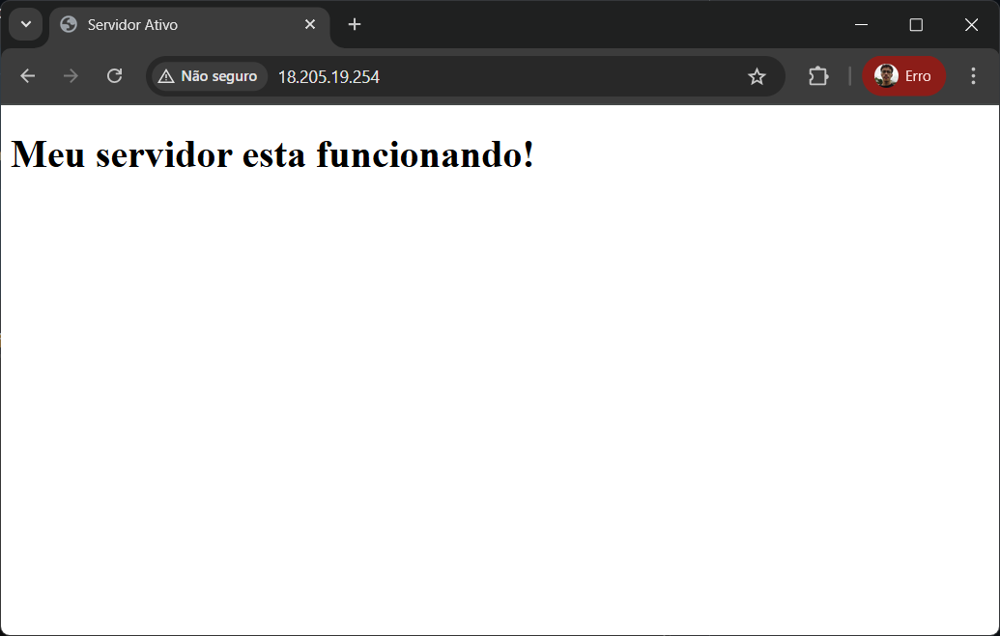<br><br>


## 📡 3. Implementação do Script de Monitoramento

### 🔹 Webhook Discord
#### Vá até o seu servidor do Discord → Configurações do Servidor → Integrações.
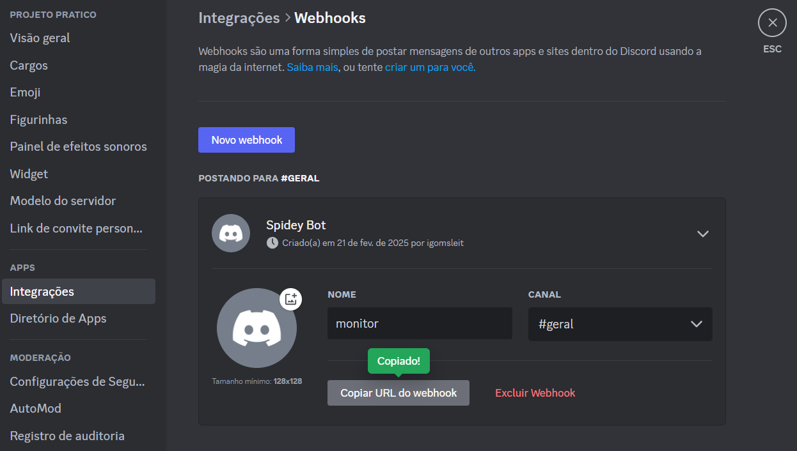

### 🔹 Criar o script `monitor.py`
```bash
nano monitor.py
```
Adicione o seguinte código:
```python
#importação de bibliotecas
import requests  # requisições HTTP
import logging   # para registrar logs
import time      # para gerenciar intervalos

# url do site monitorado
URL = "http://seu-IPv4"
# caminho do arquivo onde serão registradas as verificações
LOG_FILE = "/var/log/monitoramento.log"
# webhook discord para envio de notificações
DISCORD_WEBHOOK = "Seu-Webhook-do-Discord"

# Configuração do sistema logging para registrar eventos no arquivo de log
logging.basicConfig(
    filename=LOG_FILE, 
    level=logging.INFO, 
    format="%(asctime)s - %(message)s"
)

def verificar_site():
    """
    Função que verifica se o site está online.
    - Se o site responde com status 200 (OK), registra no log.
    - Se houver um erro envia alerta no discord.
    - Se a requisição falhar (exemplo: site fora do ar) também notifica no discord.
    """
    try:
        resposta = requests.get(URL, timeout=5)  # faz uma requisição ao site com timeout de 5 segundos
        if resposta.status_code == 200:
            logging.info("Site está online.")  # registra no log que o site está on
        else:
            notificar_discord("⚠️ O site retornou um erro!")  # envia alerta no discord se o site com algum erro
    except requests.exceptions.RequestException:
        notificar_discord("🚨 O site está fora do ar!")  # envia alerta se o site estiver fora do ar

def notificar_discord(mensagem):
    """
    Função para enviar notificações ao discord via webhook.
    - Recebe uma mensagem como parâmetro e a envia para o canal do discord.
    - Também registra a mensagem no log.
    """
    data = {"content": mensagem}  # formata a mensagem para o discord
    requests.post(DISCORD_WEBHOOK, json=data)  # envia a mensagem para o webhook
    logging.info(mensagem)  # registra a notificação no log

if __name__ == "__main__":
    """
     Executa a função verificar_site() a cada 60 segundos.
     Mantém o script rodando indefinidamente.
    """
    while True:
        verificar_site()  # verifica a disponibilidade do site
        time.sleep(60)  # aguarda 60 segundos antes de repetir a verificação

```

### 🔹 Permitir escrita no arquivo de log
```bash
sudo touch /var/log/monitoramento.log
sudo chmod 666 /var/log/monitoramento.log
```

### 🔹 Testar o script manualmente
```bash
python3 monitor.py
```

## 🔹 Configurar Execução Automática (Crontab)
```bash
crontab -e
```
Adicione a linha:
```bash
* * * * * /usr/bin/python3 /home/ubuntu/monitor.py
```
Isso fará o script rodar a cada **1 minuto**.<br><br>

   

## 🔍 4. Testes e Validação

### 🔹 Simular queda do servidor
```bash
sudo systemctl stop nginx
```
Após um minuto, você deve receber um alerta no Discord informando que o site caiu.
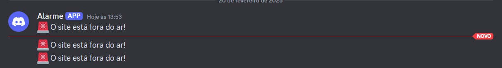

### 🔹 Restaurar o servidor
```bash
sudo systemctl start nginx
```
Se tudo estiver certo, a notificação de erro não aparecerá mais.

## 🚀 Conclusão
Chegamos ao fim do projeto, concluimos a estapa de configuração de rede do ambiente, estruturando uma VPC com subnets públicas e privadas, configuramos uma instância EC2 rodando Nginx e implementamos um sistema de monitoramento com alertas automáticos.
Agora o servidor está configurado para rodar uma aplicação web e monitorá-la automaticamente, enviando notificações em caso de falhas.

---
